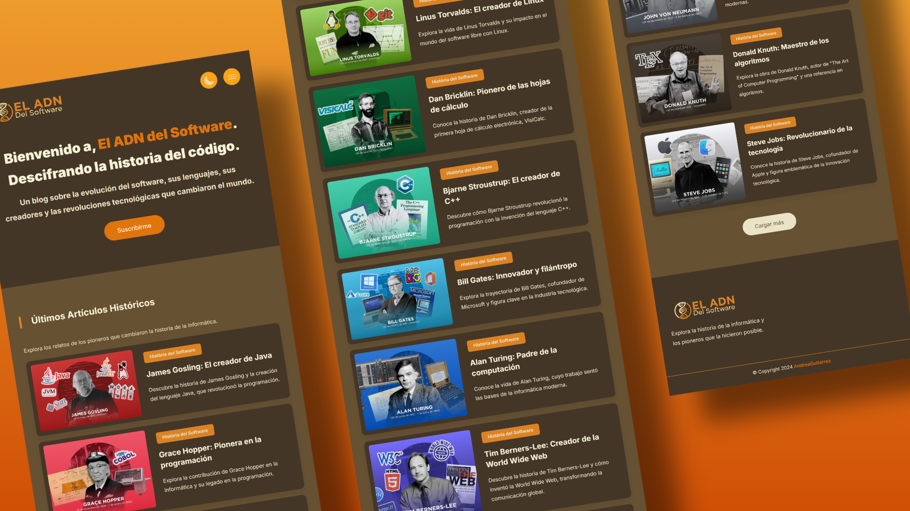

# Blog el ADN del Software 🧬

[](#)
[](#)
[](#)
[](#)


[](#)

## Descripción del proyecto

**El ADN del Software** es un blog que explora la historia del software y los pioneros que contribuyeron a las tecnologías que usamos hoy. A través de sus artículos, el blog destaca los momentos clave en la evolución del software, desde los primeros algoritmos hasta los avances más recientes.

El contenido incluye análisis de lenguajes de programación, sistemas operativos y arquitecturas de software, mostrando cómo cada innovación ha impactado el desarrollo de herramientas actuales. Además, ofrece una **Galería de Artículos** con temas variados y una **Línea del Tiempo** interactiva para seguir los hitos más importantes de la informática.

Con un enfoque directo y claro, **El ADN del Software** ofrece una visión completa de cómo el software ha moldeado el mundo moderno.


## Características

- **Diseño Responsive:** Construido con CSS Grid y Flexbox, optimizado para dispositivos móviles (Mobile First).
- **Interactividad:** Navegación dinámica y ejemplos de código ejecutables integrados.
- **Modo Oscuro/Claro:** Personalizable y persistente mediante localStorage.
- **Accesibilidad:** Interfaces amigables que facilitan la navegación para todos los usuarios.

## Requisitos Previos

- Navegador moderno (Chrome 85+, Firefox 80+, Edge 90+).
- Conexión a Internet para cargar recursos desde CDN.
- [Opcional] Servidor web local para desarrollo.

## Instalación

Clona el repositorio

```bash
git clone https://github.com/GutBla/PROJECT_El_Blog_El_ADN_del_Software.gi
```

Accede al directorio del proyecto

```bash
cd PROJECT_El_Blog_El_ADN_del_Software
```

## Uso

- Abre el archivo `index.html` en tu navegador
- Selecciona un tema (oscuro o claro) desde el interruptor en la parte superior.
- Navega por las categorías a través del menú principal para explorar los contenidos interactivos.

## Artículos del Blog

El blog rinde homenaje a las mentes más influyentes en la historia del software. Cada uno de estos pioneros dejó un legado que ha definido la informática moderna:

### **James Gosling** 🏆


Conocido como el "padre de Java", Gosling diseñó este lenguaje de programación en los años 90 con la visión de crear un sistema portátil, seguro y eficiente. Java se convirtió en la base de innumerables aplicaciones empresariales, sistemas embebidos y aplicaciones móviles, consolidándose como una de las tecnologías más influyentes en el desarrollo de software.

### **Grace Hopper** 👩‍💻


Matemática y oficial de la Marina de los EE.UU., Hopper revolucionó la programación al desarrollar el primer compilador y liderar la creación de COBOL, un lenguaje accesible que permitió que más personas programaran. Su trabajo sentó las bases de la programación moderna y la automatización del código.

### **Richard Stallman** 🛡️


Fundador del movimiento de software libre y del Proyecto GNU, Stallman promovió la filosofía de que el software debe ser accesible y modificable para todos. Su lucha por la libertad digital llevó al desarrollo de licencias como la GPL (GNU General Public License), esenciales en el ecosistema del software libre.

### **Dennis Ritchie** 🔧


Co-creador del lenguaje de programación C y del sistema operativo Unix, Ritchie transformó la forma en que se desarrollaba el software. Su trabajo estableció un estándar para los lenguajes modernos y facilitó la creación de sistemas operativos robustos, como Linux y macOS.

### **Ken Thompson** 🖥️


Ingeniero de software y co-creador de Unix junto a Ritchie, Thompson diseñó el lenguaje B (precursor de C) y herramientas esenciales como grep. Además, fue clave en el desarrollo del sistema operativo Plan 9 y creó la primera versión de la criptografía en la era moderna con su trabajo en Belle, una computadora dedicada al ajedrez.

### **Linus Torvalds** 🐧


Desarrollador del núcleo Linux, Torvalds creó un sistema operativo de código abierto que se convirtió en la base de servidores, dispositivos móviles (Android) y supercomputadoras. Su modelo de desarrollo colaborativo ha inspirado a miles de proyectos de software libre en todo el mundo.

### **Dan Bricklin** 📊


Conocido como el "padre de la hoja de cálculo", Bricklin creó VisiCalc, el primer software de este tipo, que revolucionó la manera en que las empresas gestionaban datos. Su invención sentó las bases para herramientas como Microsoft Excel y Google Sheets.

### **Bjarne Stroustrup** 🎯


Diseñador de C++, un lenguaje que combinó la eficiencia de C con programación orientada a objetos. Su contribución permitió el desarrollo de software más modular y reutilizable, influyendo en industrias como los videojuegos, la inteligencia artificial y el desarrollo de sistemas.

### **Bill Gates** 🏛️


Co-fundador de Microsoft, Gates transformó la informática personal con el desarrollo de MS-DOS y Windows, facilitando el acceso a la computación para millones de personas. Su enfoque en software comercial estableció un nuevo modelo de negocio en la industria tecnológica.

### **Alan Turing** 🤖


Considerado el padre de la informática, Turing desarrolló la teoría de las máquinas de Turing, que define los principios básicos de la computación. Además, su trabajo en la Segunda Guerra Mundial descifrando códigos nazis con la máquina Enigma salvó millones de vidas y aceleró la creación de computadoras modernas.

### **Tim Berners-Lee** 🌍


Científico de la computación que inventó la World Wide Web, desarrollando el primer navegador, servidor y el lenguaje HTML. Su trabajo permitió la creación del internet moderno, facilitando el acceso a la información y la comunicación global.

### **Ada Lovelace** 📝


Matemática del siglo XIX, Lovelace escribió el primer algoritmo diseñado para ser ejecutado por una máquina, la máquina analítica de Charles Babbage. Es considerada la primera programadora de la historia y su visión sobre la informática fue adelantada a su tiempo.

### **Jean Bartik** 🔢


Ingeniera pionera en computación, fue una de las primeras programadoras del ENIAC, una de las primeras computadoras electrónicas. Su trabajo ayudó a dar forma a la programación moderna y abrió las puertas para que más mujeres participaran en el desarrollo tecnológico.

### **John von Neumann** 🏗️


Matemático y físico que estableció el modelo de arquitectura de las computadoras modernas, conocido como "arquitectura de von Neumann". Su trabajo es la base de todos los sistemas computacionales actuales y sus contribuciones abarcaron desde la informática hasta la teoría de juegos y la mecánica cuántica.

### **Donald Knuth** 📚


Autor de *The Art of Computer Programming*, una de las obras más influyentes en la historia de la computación. Su trabajo en algoritmos y estructuras de datos estableció los fundamentos del análisis de eficiencia en la programación moderna.

### **Steve Jobs** 🍏


Co-fundador de Apple, revolucionó la industria tecnológica con productos innovadores como el Macintosh, el iPhone y el iPad. Su enfoque en la experiencia del usuario y el diseño marcó un antes y un después en la informática personal y los dispositivos móviles.

Estos visionarios han definido el desarrollo del software y sus ideas siguen siendo fundamentales en la era digital. En el blog, exploramos sus contribuciones y cómo siguen impactando el mundo tecnológico.

## Ejecución del Proyecto

Para ver el proyecto en acción, visita la [demo en GitHub Pages](https://gutbla.github.io/PROJECT_El_Blog_El_ADN_del_Software/). o a la direccion:

```bash
https://gutbla.github.io/PROJECT_El_Blog_El_ADN_del_Software/
```





